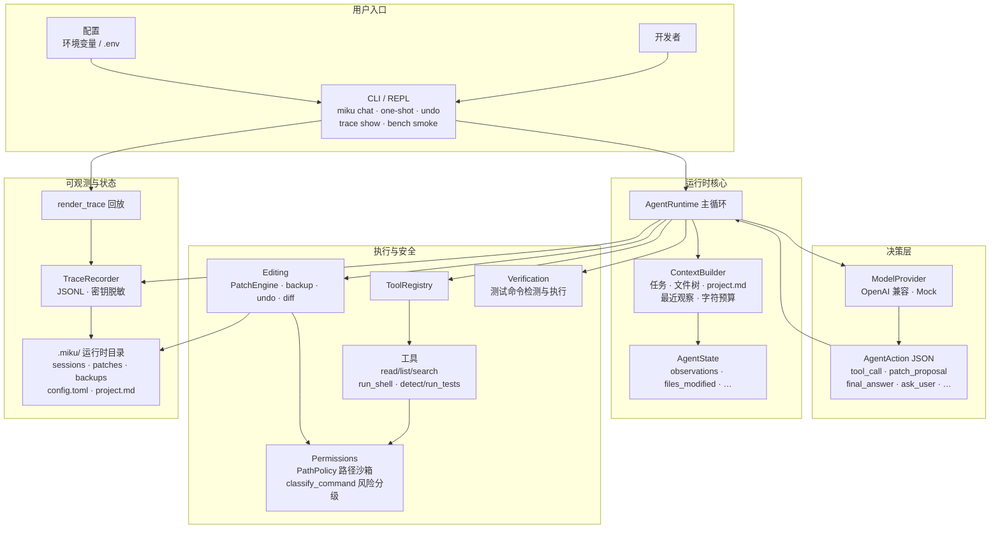
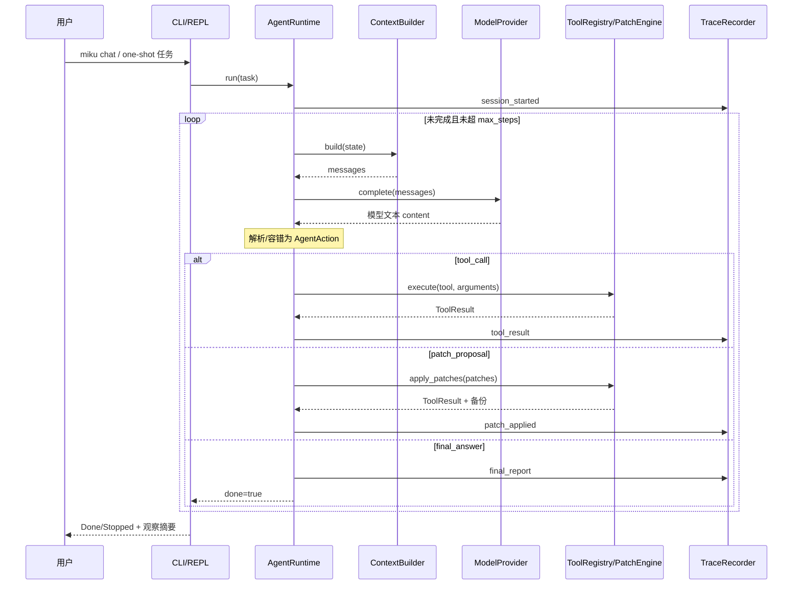
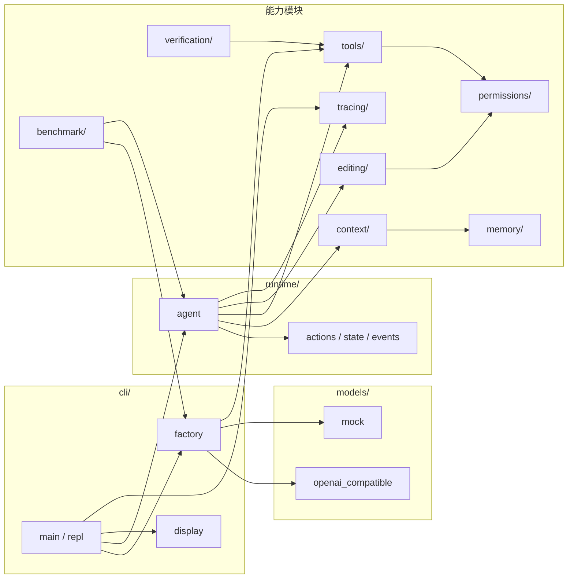

# MikuCode

MikuCode 是一个基于 Python 的**本地编程智能体运行时**，设计思路参考 Claude Code / Codex。

核心原则：**把 LLM 当作决策引擎，而不是执行器**。模型只输出结构化的 JSON `AgentAction`；运行时负责校验、权限控制、执行工具、应用补丁、记录轨迹，并基于证据做验证。模型不会直接改文件或裸跑 shell。

当前状态：**B 版（Task 1–9）已完成**，可用 `miku chat` / one-shot 对接 OpenAI 兼容 API（含 OpenRouter），支持读文件、搜索、补丁编辑与撤销等。

## 功能亮点

- **OpenAI 兼容模型层**（httpx），并提供 MockProvider 做确定性测试
- **JSON Action 协议**（`tool_call`、`patch_proposal`、`final_answer` 等）
- **REPL + 单次任务 CLI**（`miku chat`、`miku "<任务>"`）
- **带权限的工具**：路径沙箱、密钥文件拒绝、命令风险分级
- **基于补丁的编辑**：唯一匹配的 `search_replace`、`create_file`、备份与 `undo`
- **上下文与项目记忆**：文件树、`.miku/project.md`、最近观察
- **证据驱动的验证**：测试命令检测与受控 shell 执行
- **可回放轨迹**：JSONL 会话 + 密钥脱敏（`miku trace show`）
- **冒烟基准**：确定性端到端 harness（`miku bench smoke`）
- **`.env` 配置**：无需每次手动设置 PowerShell 环境变量

## 系统架构

原则一句话：**模型提议意图，运行时门控执行**（校验 → 授权 → 执行 → 记录 → 可回滚 / 可验证）。

下列图为 **Mermaid 源码图**（GitHub / 多数 Markdown 预览可直接渲染；文字清晰、可版本管理）。

### 总览：分层架构



### 一次任务：运行时序



### 模块依赖（代码目录视角）



### 数据流要点

| 流向 | 说明 |
|------|------|
| 用户 → CLI | 交互或单次任务；加载 `.env` |
| Runtime → 模型 | 只要 **结构化决策**（JSON Action），不要模型直接 IO |
| Runtime → 工具/补丁 | 一律经 Registry / PatchEngine；权限在 PathPolicy / risk |
| Runtime → Trace | 关键节点落 JSONL（含脱敏） |
| 补丁 → `.miku/backups` | 先备份再写；`undo` 按清单恢复 |

## 快速开始


需要 Python `>=3.11` 与 [uv](https://github.com/astral-sh/uv)。

```powershell
cd A:\study\AI\LLM\Fable-5   # 或你的仓库路径
uv sync
copy .env.example .env
# 编辑 .env，填入 API Key / Base URL / 模型名
uv run miku init
uv run miku chat
```

### 常用命令

```powershell
# 单次任务
uv run miku "列出项目结构并简要说明"

# 撤销最近一次补丁
uv run miku undo

# 回放会话轨迹
uv run miku trace show .miku\sessions\<时间戳>-session.jsonl

# 冒烟测试（无 API Key 时使用内置 Mock）
uv run miku bench smoke

# 单元测试与静态检查
uv run pytest
uv run ruff check src tests
```

## 模型配置

| 环境变量 | 含义 |
|----------|------|
| `MIKU_OPENAI_BASE_URL` | OpenAI 兼容 API 根路径（默认 `https://api.openai.com/v1`） |
| `MIKU_OPENAI_API_KEY` | API 密钥（也识别 `OPENAI_API_KEY`） |
| `MIKU_MODEL` | 模型名（默认 `gpt-4o-mini`） |
| `MIKU_MOCK_RESPONSES` | 强制走 Mock 的 JSON 数组（AgentAction 列表） |

### 推荐使用 `.env` 文件

不必每次都设置 `$env:...`。

```powershell
copy .env.example .env
# 用编辑器填写真实密钥与模型
uv run miku chat
```

规则：

- 会加载当前目录的 `.env`，以及 `--project-root` 下的 `.env`
- **不会覆盖** shell 里已经设置的变量（临时 `$env:MIKU_MODEL=...` 仍然优先）
- `.env` 已被 gitignore；仓库只保留 `.env.example`

OpenRouter 示例（`.env`）：

```env
MIKU_OPENAI_API_KEY=sk-...
MIKU_OPENAI_BASE_URL=https://openrouter.ai/api/v1
MIKU_MODEL=tencent/hy3:free
```

注意：Base URL **必须包含 `/v1`**，最终请求为 `{base}/chat/completions`。

Mock 单次任务示例（PowerShell）：

```powershell
$env:MIKU_MOCK_RESPONSES = '[{"type":"final_answer","summary":"done"}]'
uv run miku "say hello"
```

## 安全模型（B 版）

MikuCode B 是**开发者安全**运行时，不是加固的对抗沙箱：

- **路径沙箱**：只允许项目根内路径；拒绝逃逸、密钥类文件（如 `.env`）、`.git` 内部
- **命令风险**：`classify_command` → allow / ask / deny；仅低风险命令自动执行
- **超时与输出上限**：shell 有超时；大输出截断
- **轨迹脱敏**：写入 JSONL 前脱敏 API Key、Bearer 等
- **补丁备份与撤销**：编辑走 proposal → 备份 → 应用；`miku undo` / REPL `/undo` 恢复最近备份

B 版不做：Docker 沙箱、完整 MCP、Web 控制台、IDE 扩展、多 Agent 并行。

## 项目结构

```text
src/mikucode/
  cli/           # Typer 入口、REPL、provider/registry 工厂、结果展示
  runtime/       # Agent 循环、Action/State/事件、容错解析
  models/        # Mock 与 OpenAI 兼容 Provider
  tools/         # 文件系统、搜索、shell、测试工具
  permissions/   # 路径策略与命令风险
  editing/       # 补丁、diff、备份、undo
  context/       # 文件树与上下文组装
  memory/        # project.md 记忆
  tracing/       # JSONL 记录、脱敏与回放
  verification/  # 测试命令检测与执行
  benchmark/     # 冒烟基准
```

运行时状态在 `.miku/`（已 gitignore）：`sessions/`、`patches/`、`backups/`、`config.toml`、`project.md`。

## 协议提示（给模型 / 调试）

模型应返回**单个** JSON `AgentAction`（不要 markdown 代码围栏）。常见类型：

```json
{"type":"final_answer","summary":"回答内容"}
{"type":"tool_call","tool":"read_file","arguments":{"path":"README.md"},"reason":"..."}
{"type":"tool_call","tool":"search_text","arguments":{"query":"classify_command"},"reason":"..."}
{"type":"patch_proposal","patches":[{"kind":"search_replace","path":"a.py","old_text":"x","new_text":"y"}],"reason":"..."}
```

运行时对常见模型失误有容错（纯文本回退 `final_answer`、扁平 `patch_proposal` 归一化、搜索参数别名等），但**规范 JSON** 仍然最稳。

## 路线图（C 版设想）

- Web 轨迹 / 会话面板
- 更完整的 MCP 协议
- 角色化 / 多 Agent
- Docker 等更强隔离
- 更完整的验证套件与基准报告
- IDE 集成

## 许可证

若仓库根目录有 LICENSE 文件则以之为准；否则默认视为学习/私有项目，公开发布前请自行补充许可。
